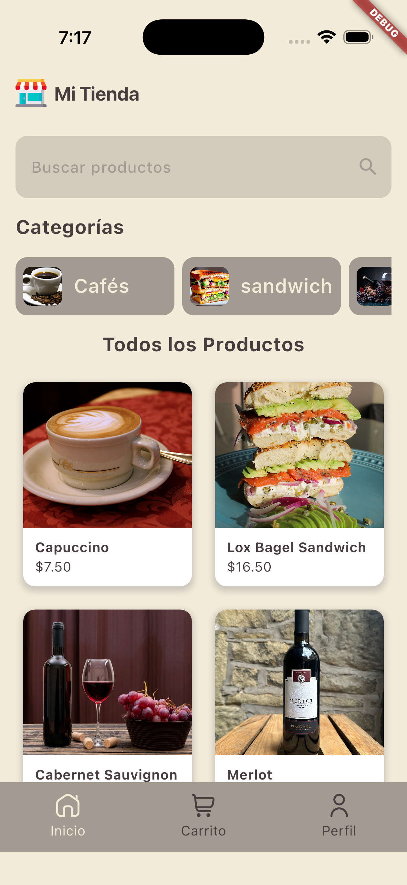

# store_demo_class

Flutter app (Android / iOS / Web) backed by Firebase Auth + Cloud Firestore.



## Getting Started

This project is a starting point for a Flutter application.

A few resources to get you started if this is your first Flutter project:

- [Learn Flutter](https://docs.flutter.dev/get-started/learn-flutter)
- [Write your first Flutter app](https://docs.flutter.dev/get-started/codelab)
- [Flutter learning resources](https://docs.flutter.dev/reference/learning-resources)

For help getting started with Flutter development, view the
[online documentation](https://docs.flutter.dev/), which offers tutorials,
samples, guidance on mobile development, and a full API reference.

---

## Firebase Setup (required to run the app)

The Firebase config files contain API keys, project IDs and app IDs, so they
are **not** committed to this repository (see `.gitignore`). You must generate
them locally before `flutter run` will work.

### 1. Create the Firebase project

1. Go to <https://console.firebase.google.com/> and create (or open) the
   project you want to use. The ID used by this app is
   `my-store-demo-class-9682c` — pick the same one if you want to keep the
   existing backend, or any new one if you are starting fresh.
2. In **Authentication → Sign-in method**, enable the providers you need
   (Email/Password, Google, etc.).
3. In **Firestore Database**, create the database (start in test mode for
   local development, then lock it down with proper rules before shipping).

### 2. Register your apps in Firebase

For every platform you want to run, add an app in the Firebase console and
copy the corresponding config file into the project:

| Platform | Where to get the file                  | Where to put it                            |
| -------- | -------------------------------------- | ------------------------------------------ |
| Android  | Project settings → Your apps → Android | `android/app/google-services.json`         |
| iOS      | Project settings → Your apps → iOS      | `ios/Runner/GoogleService-Info.plist`      |
| macOS    | Project settings → Your apps → macOS    | `macos/Runner/GoogleService-Info.plist`    |
| Web      | Project settings → Your apps → Web      | generated by FlutterFire CLI (see step 3)  |

The Android package name and iOS bundle ID must match the values in
`android/app/build.gradle.kts` (`applicationId`) and `ios/Runner.xcodeproj`
(`PRODUCT_BUNDLE_IDENTIFIER`).

### 3. Generate `lib/firebase_options.dart` with the FlutterFire CLI

This file wires the Dart side (`firebase_core`) to the platform configs. It
is generated, not edited by hand.

```bash
# Install the CLI once
dart pub global activate flutterfire_cli

# Log in to Firebase
firebase login

# Re-create firebase_options.dart for every platform you need
flutterfire configure \
  --project=my-store-demo-class-9682c \
  --platforms=android,ios,web
```

`flutterfire configure` will also write `android/app/google-services.json`
and `ios/Runner/GoogleService-Info.plist` for you, so you can skip step 2
for those platforms if you run this first.

### 4. Verify the app builds

```bash
flutter pub get
flutter run
```

If the app crashes on startup with a `FirebaseOptions` error, double-check
that `lib/firebase_options.dart` exists and that the platform you are
running on is listed in the `flutterfire configure` call above.

### Security notes

- Never commit `google-services.json`, `GoogleService-Info.plist`,
  `firebase_options.dart`, or any service-account JSON. They are all
  already listed in `.gitignore`.
- If a key ever leaks into git history, rotate it from the Firebase
  console **and** force-push only after cleaning the history — the GitHub
  push protection will reject secrets on PRs.
- Lock down your data with proper
  [Firestore Security Rules](https://firebase.google.com/docs/firestore/security/get-started)
  and [App Check](https://firebase.google.com/docs/app-check) before going
  to production.
